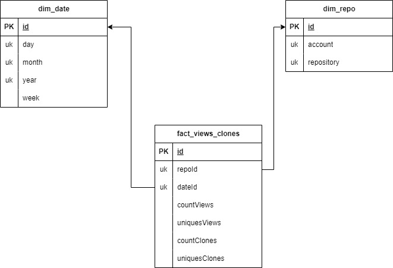

# Collecting GitHub Metrics

This project uses the GitHub API to collect traffic metrics from a set of repositories within an organization. It deploys an Azure Logic App to consume the GitHub API, and the gathered information is saved in a SQL database.  
The traffic data is available for the past 12 days. This implementation helps preserve the data for ongoing analysis over time.  
The application collects [views](https://docs.github.com/en/rest/metrics/traffic?apiVersion=2022-11-28#get-page-views) and [clones](https://docs.github.com/en/rest/metrics/traffic?apiVersion=2022-11-28#get-repository-clones) information from the repositories.

## Getting a GitHub Token

To use the GitHub API, you need a personal access token.
Follow the steps described in this guide to [creating a fine-grained personal access token](https://docs.github.com/en/authentication/keeping-your-account-and-data-secure/managing-your-personal-access-tokens#creating-a-fine-grained-personal-access-token).  
Please note that, according to the API documentation, you need to include `"Administration" repository permissions (read)`.  
Please make sure to keep your token secure.

## Deploy the Azure Resources

The Azure SQL Database, Azure Logic App, and other necessary resources will be deployed.

The database is going to be Microsoft Entra ID integrated. A user name, user object id, and tenat id are going to be needed.

```bash
export USER=eastus<your data>
export USER_OBJECTID=<your data>
export USER_TENANTID=<your data>
```

The resource group creation

```bash
export LOCATION=eastus2
export RESOURCEGROUP_BASE_NAME=rg-github-metrics-collector
export RESOURCEGROUP=${RESOURCEGROUP_BASE_NAME}-${LOCATION}
az group create --name ${RESOURCEGROUP} --location ${LOCATION}
```

Please add the GitHub token, the GitHub account, and the array of repos array to be collected, then proceed to deploy.

```bash
az deployment group create --resource-group ${RESOURCEGROUP}  \
                        -f ./main.bicep  \
                        -p token=<GitHub Token>  \
                        administratorLoginPassword=changeMe123!  \
                        owner=mspnp  \
                        repositories='["samples", "iaas-baseline", "aks-baseline"]'  \
                        user=${USER} \
                        userObjectId=${USER_OBJECTID} \
                        userTenantId=${USER_TENANTID}
```

## Create Databse Objects

1. Navigate to the resource group using the Azure Portal.
2. Select the SQL Database
3. Select the Query Editor
4. Enter your username and password. The first time you do this, you’ll need to configure the firewall by following the portal instructions.
5. Copy the code from ./scripts.sql, and paste on the Query Editor
6. Execute
7. Review the table that was created and explore any store procedures

## Error

So far, we have an error in the connector to the database, a new one need to be created using Azure Portal and associate with the activities.

## Test the Workflow

1. Navigate to the resource group using the Azure Portal.
2. Select the Azure Logic App
3. Select the Logic app designer
4. Run it
5. Select Run History, and see if the workflow was succeced executed
6. Select the SQL Database
7. Select the Query Editor
8. Enter your username and password.
9. See the data in the tables

## Report

A star model was created in order to query the data. There are to dimentional tables and one fact table.



The following is a query example on the star model. It returns the sum of values by account-repository and by week of the year.

```sql
SELECT
    dates.year,
    dates.month,
    dates.week,
    repo.account,
    repo.repository,
    SUM(fact.countViews) AS TotalCountViews,
    SUM(fact.uniquesViews) AS TotalUniquesViews,
    SUM(fact.countClones) AS TotalCountClones,
    SUM(fact.uniquesClones) AS TotalUniquesClones
FROM
    fact_views_clones fact
INNER JOIN
    dim_date dates ON fact.dateId = dates.id
INNER JOIN
    dim_repo repo ON fact.repoId = repo.id
GROUP BY
    dates.year,
    dates.month,
    dates.week,
    fact.repoId,
    repo.account,
    repo.repository
ORDER BY
    repo.account,
    repo.repository,
    dates.week
```

## Clean up

```bash
az group delete --name ${RESOURCEGROUP} --yes
```

## Pending

- Move Database connector to a Active directory base one
- See I can resolve the deploy script to be able to connect the database after deploy
- Check security flags

